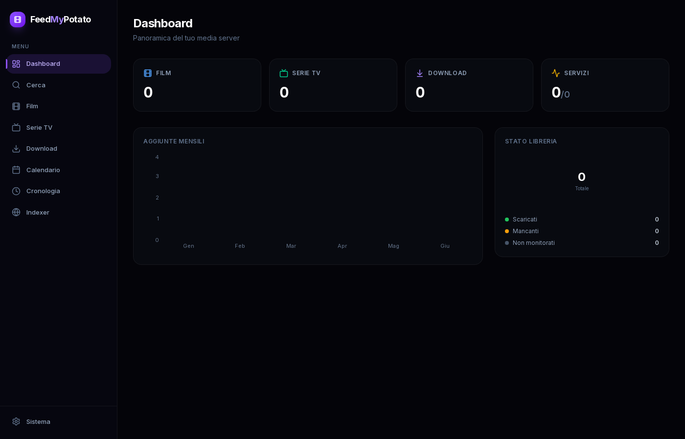
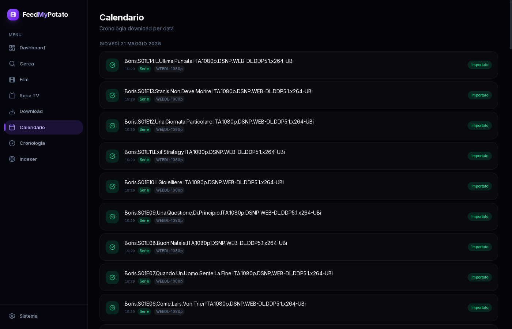
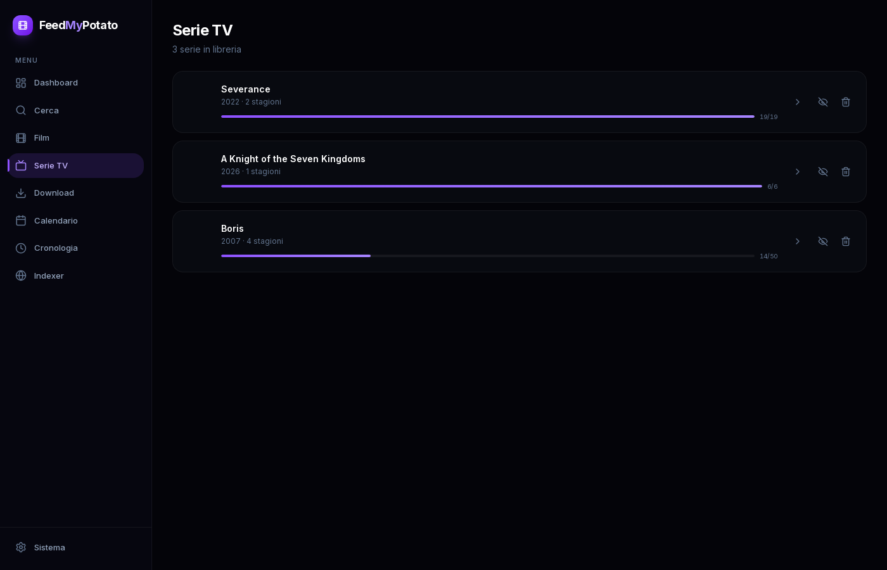
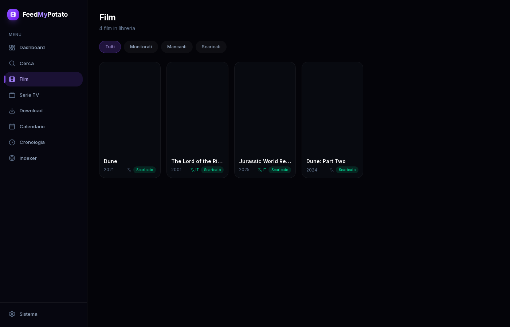
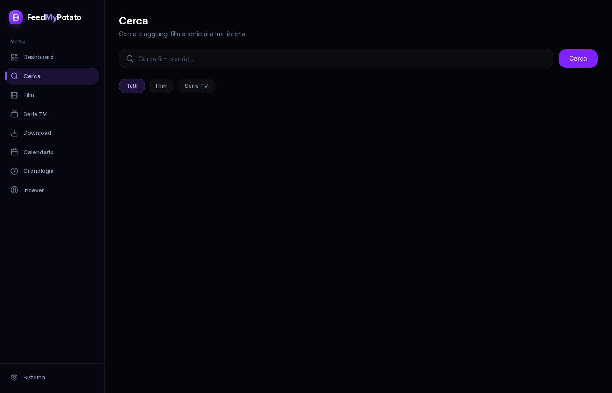

# FeedMyPotato

Web app per cercare, scaricare e gestire contenuti multimediali direttamente nella tua libreria Plex — tutto da un'unica interfaccia.


---

## Screenshots

| Dashboard | Calendario |
|:---------:|:----------:|
|  |  |

| Serie | Film |
|:-----:|:----:|
|  |  |

| Ricerca |
|:-------:|
|  |

---

## Come funziona

```
Browser → FeedMyPotato (Next.js)
               ├── Sonarr  ──┐
               ├── Radarr  ──┤── Prowlarr → indexer
               ├── Prowlarr  │
               ├── Bazarr    └── qBittorrent (via Gluetun VPN)
               └── qBittorrent        ↓
                                /mnt/media ← Plex
```

1. Cerchi un film o una serie su FeedMyPotato
2. Il contenuto viene aggiunto a Sonarr o Radarr che cercano il miglior release tramite Prowlarr
3. Il torrent viene inviato a qBittorrent, che scarica tramite VPN (Gluetun)
4. Il file viene salvato nella cartella media — Plex lo rileva automaticamente
5. Bazarr scarica i sottotitoli in automatico

---

## Stack

| Componente | Ruolo |
|---|---|
| **Next.js 15** | Frontend + API proxy (App Router) |
| **Sonarr** | Gestione e automazione serie TV |
| **Radarr** | Gestione e automazione film |
| **Prowlarr** | Aggregatore indexer torrent |
| **qBittorrent** | Client torrent con WebUI/API |
| **Bazarr** | Download automatico sottotitoli |
| **Plex** | Media server |
| **FlareSolverr** | Bypass Cloudflare per indexer protetti |
| **Gluetun** | VPN gateway (NordVPN WireGuard) |

---

## Avvio rapido

### Prerequisiti

- Docker e Docker Compose
- Account NordVPN con chiave WireGuard (o altro provider supportato da Gluetun)
- Una libreria Plex esistente su disco

### 1. Clona il repo

```bash
git clone https://github.com/gallofrancesco1312/feed-my-potato.git
cd feed-my-potato
```

### 2. Configura le variabili d'ambiente

Crea un file `.env` nella root del progetto:

```env
NORDVPN_PRIVATE_KEY=your_wireguard_private_key
```

> La chiave WireGuard si recupera dal pannello NordVPN → **Manual Setup → WireGuard**.

### 3. Crea il file di configurazione app

Crea `config.json` nella root del progetto:

```json
{
  "sonarr": { "url": "http://feed-my-potato-sonarr:8989", "apiKey": "" },
  "radarr": { "url": "http://feed-my-potato-radarr:7878", "apiKey": "" },
  "prowlarr": { "url": "http://feed-my-potato-prowlarr:9696", "apiKey": "" },
  "bazarr": { "url": "http://feed-my-potato-bazarr:6767", "apiKey": "" },
  "qbittorrent": { "url": "http://localhost:8080", "username": "admin", "password": "" }
}
```

> Le API key vengono lette automaticamente dai file di configurazione dei servizi se monti i volumi come da `docker-compose.yml`. Il `config.json` è opzionale.

### 4. Adatta i percorsi media in `docker-compose.yml`

Sostituisci `/mnt/hdd1/media` con il percorso della tua libreria:

```yaml
volumes:
  - /percorso/tua/libreria:/data
```

### 5. Sostituisci i placeholder

Nel `docker-compose.yml` sostituisci:

| Placeholder | Valore |
|---|---|
| `YOUR_REGISTRY` | Registry Docker da cui pullare l'immagine |
| `YOUR_DOMAIN` | Il tuo dominio (es. `home.example.com`) |

### 6. Avvia i container

```bash
docker compose up -d
```

### 7. Setup automatico

Una volta che tutti i servizi sono online, chiama l'endpoint di setup per configurare automaticamente Sonarr e Radarr (root folder, qBittorrent come download client, remote path mapping):

```bash
curl -X POST http://localhost:3000/api/setup
```

### 8. Configura Prowlarr

1. Apri Prowlarr su [http://localhost:9696](http://localhost:9696)
2. Aggiungi gli indexer che vuoi usare
3. In **Settings → Apps** aggiungi Sonarr e Radarr — Prowlarr li sincronizzerà automaticamente

### 9. Apri FeedMyPotato

[http://localhost:3000](http://localhost:3000)

---

## Pagine

| Pagina | Percorso | Descrizione |
|---|---|---|
| **Dashboard** | `/` | Statistiche libreria, spazio disco, salute servizi, prossime uscite, download attivi |
| **Serie** | `/series` | Libreria serie TV gestita da Sonarr |
| **Film** | `/movies` | Libreria film gestita da Radarr |
| **Calendario** | `/calendar` | Prossime uscite da Sonarr e Radarr |
| **Cerca** | `/search` | Ricerca e aggiunta di film e serie a Sonarr/Radarr |
| **Download** | `/downloads` | Monitoraggio download attivi in tempo reale (SSE) |
| **Cronologia** | `/history` | Storico download da Sonarr e Radarr |
| **Indexer** | `/indexers` | Stato e gestione indexer Prowlarr |
| **Sistema** | `/system` | Health check aggregato di tutti i servizi |

---

## Porte esposte

| Servizio | Porta |
|---|---|
| FeedMyPotato | `3000` |
| qBittorrent WebUI | `8080` |
| Radarr | `7878` |
| Sonarr | `8989` |
| Prowlarr | `9696` |
| FlareSolverr | `8191` |
| qBittorrent (traffico torrent) | `16881` |

> Radarr, Sonarr, Prowlarr e qBittorrent girano all'interno della rete VPN Gluetun. Il traffico torrent esce esclusivamente tramite VPN.

---

## Sviluppo locale

```bash
npm install
npm run dev
```

App disponibile su [http://localhost:3000](http://localhost:3000).

Per i test:

```bash
npm test
```

---

## Struttura del progetto

```
feed-my-potato/
├── app/
│   ├── api/          # Proxy verso Sonarr, Radarr, Prowlarr, qBit, Bazarr
│   ├── (pagine)/     # calendar, downloads, history, indexers, movies, search, series, system
│   └── page.tsx      # Dashboard
├── components/       # Componenti React (sidebar, tabelle, grafici)
├── lib/              # Config, client arr, utility
├── docs/
│   └── screenshots/  # Screenshot dell'interfaccia
├── Dockerfile
└── docker-compose.yml
```
